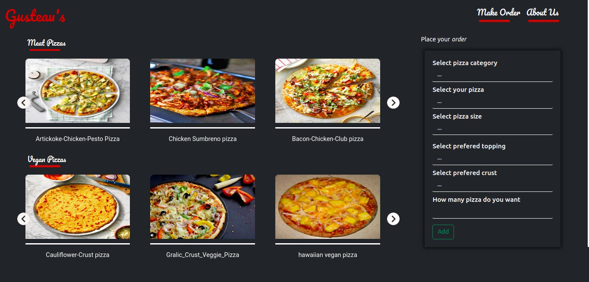

# Gusteaus-Pizzeria

## Description

Gusteau's pizzeria is a online pizza order and delivery website that allows a user to order pizza online and choose a delivery option if they would want it delivered to them,otherwise they can collect it when it is ready.

## Live site

Visit the live site [Here](https://mugerah.github.io/Gusteaus-Pizzeria/.)

## Preview

## Project Setup Instructions

- Open Terminal {Ctrl+Alt+T}
- git clone https://github.com/MugeraH/Gusteaus-Pizzeria.git
- cd delani-studio
- code .(for Vs Code) or atom .(for Atom)

1. Ensure the following stylesheets have also be linked to you project

- [Bootstrap 4](https://maxcdn.bootstrapcdn.com/bootstrap/4.0.0/css/bootstrap.min.css)
- [google Fonts](https://use.fontawesome.com/releases/v5.5.0/css/all.css)

2. Script CDN

- [Javascript](https://ajax.googleapis.com/ajax/libs/jquery/3.5.1/jquery.min.js)

## Technologies Used

1. HTML5
2. CSS
3. BootStrap
4. JavaScript
5. Markdown

## Behaviour Driven Development
* ORDER PIZZA

INPUTS
1. Pizza name
2. Pizza size
3. Pizza Crust
4. Pizza Toppings

BEHAVIOUR
User inputs the above inputs, on inputting pizza size, the toppings available for that size are provided in a drop down list where the select. Once everything has been filled, their items are added to a cart table.when they finish shopping they checkout the cart and their total bill is provided for them.

OUTPUTS
1. Total bill.

* REQUEST PIZZA DELIVERY

INPUTS
1. Name
2. Mobile Phone Number
3. Location

BEHAVIOUR

User inputs name,phone number and location then clicks on the submit button.On submit,validation is done first,then a message acknowledging the reciept of the message indicating the total price,and phone number is outputted as an alert.

OUTPUTS
1. Message
"
Dear {customerName} your order will be delivered to {customerLocation} within
  two hours! Your order total is Ksh.{costWithDelivery} Our rider will call
  you you on arrival or you can reach us at 0721000000 if you do not recieve any communication within the specific time period"
  
## Author

[Mugera Hughes](https://github.com/MugeraH)

## Contact Information

For any further inquiries or contributions or comments, reach me at [Mugera Hughes](https://github.com/MugeraH)

### License

[MIT License](https://github.com/MugeraH/Gusteaus-Pizzeria/blob/main/license) Copyright (c) {2021}